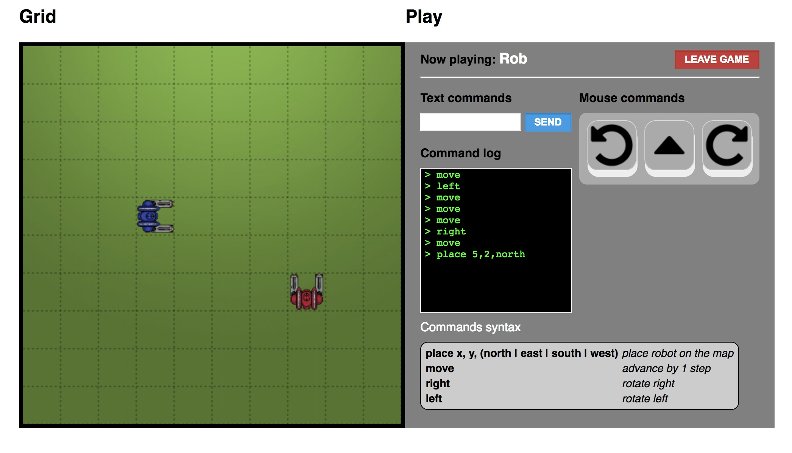

Web Robot
---------

This is a personal, fun spin of a typical code test that I had been asked to perform during the interview process for a software engineer position.

The goal is to move a Robot across a Grid or 2-dimensional map using instructions in the form of strings. Usually the code test requires to implement a command-line based solution where you input text through the terminal.

This version of the exercise offers a Web based interface where the user can use text input fields and the keyboard or buttons and the mouse to drive the robot movement. To make things more interesting I've extended the problem to allow multiple users/robots to enter the grid and share the space with each other.

The implementation uses a `ruby/sinatra` backend, `WebSockets` and standard `javascript`.

### Pre-requisites
- ruby, version 2.5 or higher
- `bundler` gem, version 1.16 or higher

### Install
- Run `bundle install`

### Run
- Execute `bundle exec puma` (`-p` option if you want to change the port number)

### Play
- Navigate your browser to `http://localhost:9292`

### Screenshot

